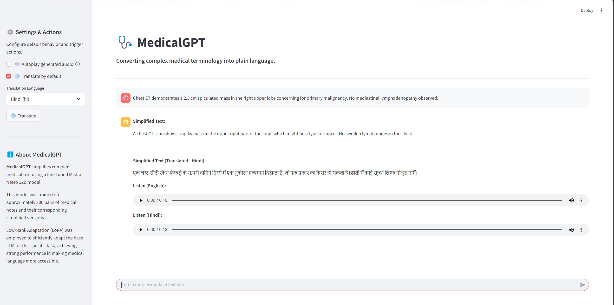
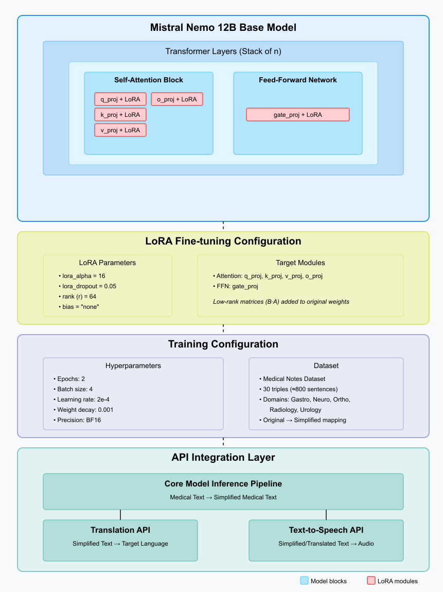

# MedicalGPT: Medical Text Simplifier 🩺

This project provides a user-friendly interface (built with Streamlit) to interact with a fine-tuned Mistral-Nemo 12B language model specialized in simplifying complex medical text. The goal is to make medical terminology more accessible to patients and non-specialists, complemented by translation and text-to-speech features.

**Core Functionality:** Converts complex medical notes, reports, or instructions into plain, easy-to-understand language.

## ✨ Features

* **📝 Text Simplification:** Leverages a fine-tuned LLM to simplify input medical text.
* **🌐 Translation:**
    * Translate simplified text into multiple languages (e.g., Spanish, French, German, Hindi, etc.).
    * Option to enable translation by default upon simplification.
    * Manually translate the last simplified message via the sidebar.
* **🔊 Text-to-Speech (TTS):**
    * Listen to the simplified English text.
    * Listen to the translated text (if translation is performed).
    * Option to attempt *autoplay* of audio when generated (browser-dependent).
* **⚙️ Settings:** Configure default behavior for translation and audio autoplay via the sidebar.



## 🚀 Technology Stack

* **Frontend:** Streamlit
* **Backend LLM API:** Fine-tuned Mistral-Nemo 12B model (served via HTTP endpoint)
* **Core Python Libraries:** `requests`, `gTTS`, `googletrans`
* **Model Fine-Tuning (See Training Details):** Hugging Face `transformers`, `peft` (LoRA), `datasets`, `bitsandbytes`

### Application Architecture



## 🧠 Model Details

The simplification capability relies on a `Mistral-Nemo-Instruct-2407` (12B parameter) model fine-tuned specifically for this task using Low-Rank Adaptation (LoRA). The fine-tuning process utilized a dataset of medical text pairs (original and simplified) and targeted specific model layers for efficient adaptation.

For comprehensive details on the dataset, fine-tuning process (LoRA configuration, hyperparameters), adapter merging, interactive testing, and evaluation results (including methodology and scores), please refer to the dedicated README within the training notebooks folder:

➡️ **[Training & Deployment Notebooks Details](./training-deploying_notebooks/readme.md)**

## 📁 Repository Structure

```
├── training-deploying_notebooks/           # Contains notebooks for: 
│   ├── stage1_finetuning_mistral-12b.ipynb   # fine-tuning, 
│   ├── stage2_merge_model.ipynb              # merging,
│   ├── stage3_live_chat.ipynb                # testing,
│   ├── stage4_evaluation.ipynb               # evaluation.
│   └── README.md                           # Detailed explanation of the notebooks
├── app.py                                  # The Streamlit frontend application code
├── requirements.txt                        # Python dependencies for the Streamlit app
└── README.md                               # This main README file

```

## 🛠️ Getting Started

To run the Streamlit frontend application locally, follow these steps:

1.  **Clone the Repository:**
    ```bash
    git clone <your-repo-url>
    cd <your-repo-name>
    ```

2.  **Create and Activate a Virtual Environment:**
    ```bash
    # For Linux/macOS
    python3 -m venv venv
    source venv/bin/activate

    # For Windows
    python -m venv venv
    .\venv\Scripts\activate
    ```

3.  **Install Dependencies:**
    ```bash
    pip install -r requirements.txt
    ```
    *Note: Ensure you have upgraded Streamlit if you encountered issues with `autoplay` or `key` arguments previously: `pip install --upgrade streamlit`*

4.  **❗️ IMPORTANT: Ensure Backend API is Running:**
    This Streamlit application (`app.py`) is only the **frontend**. It requires the fine-tuned Mistral-Nemo model to be deployed and running as an API service that it can send requests to.
    * Make sure your LLM API endpoint (like the one referenced by `API_URL = "http://17.26.71.138:40/v1/completions"` in the code) is active and accessible from where you are running the Streamlit app.
    * If your API endpoint URL is different, update the `API_URL` constant near the top of `app.py`.

    **📌 Architecture Note:** The Streamlit application (`app.py`) acts purely as a frontend. It **does not load the large language model locally**. Instead, it communicates with a separate backend API service where the fine-tuned model is hosted and run (potentially optimized with inference servers like **vLLM**). This differs from methods like using `transformers.pipeline` directly within the application script (as shown in your example snippet or potentially demonstrated in earlier development/testing notebooks like `stage3_live_chat.ipynb`). For this app to function, the API backend *must* be operational.

5.  **Run the Streamlit App:**
    ```bash
    streamlit run app.py
    ```

6.  Open your web browser and navigate to the local URL provided by Streamlit (usually `http://localhost:8501`).

## Usage

1.  Enter or paste the complex medical text into the chat input box at the bottom.
2.  Press Enter or click the send button.
3.  The simplified text (and translation, if enabled by default) will appear in the chat window.
4.  Use the sidebar (⚙️ Settings & Actions) to:
    * Toggle default translation and select the language.
    * Toggle audio autoplay (browser permitting).
    * Manually trigger a translation of the *last* simplified message using the selected language.
5.  Click the speaker icons (🔊 Listen...) within the chat messages to play the corresponding audio.

## 🏋️‍♀️ Training & Evaluation Details

As mentioned earlier, the process of fine-tuning the model, merging the adapter, performing initial tests, and evaluating the simplification quality is documented in separate Jupyter notebooks. Please see the detailed README in the `training-deploying_notebooks/` directory for instructions and explanations:

➡️ **[Training & Deployment Notebooks Details](./training-deploying_notebooks/README.md)**

## 📬 Contact

For inquiries regarding this project, including aspects of LLM deployment (API endpoint integration, offline model loading), or if you have any questions or potential collaboration ideas, please feel free to reach out:

* **Email:** [pranavjpatel.08@gmail.com](mailto:pranavjpatel.08@gmail.com)
* **LinkedIn:** [Pranav Patel](https://www.linkedin.com/in/pranavpatel08/)