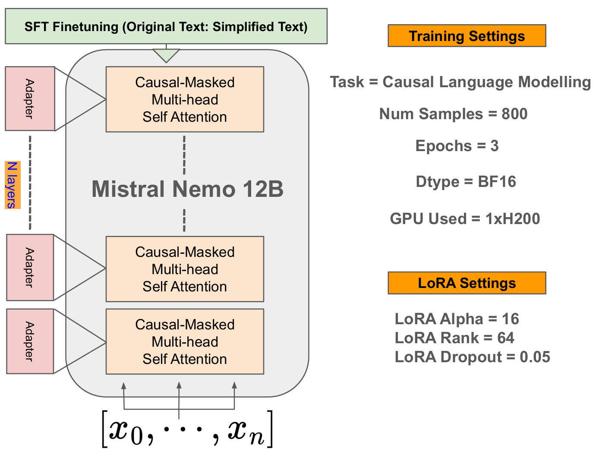
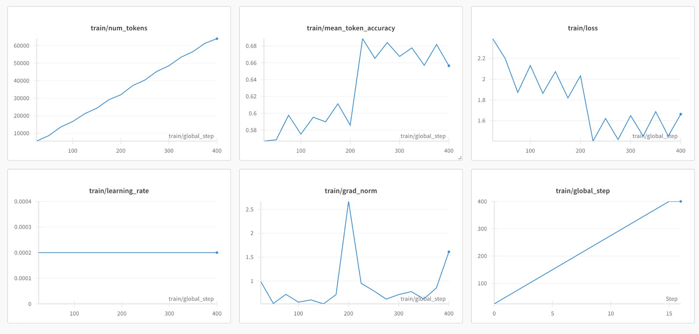
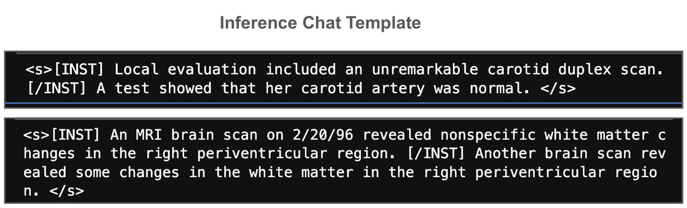
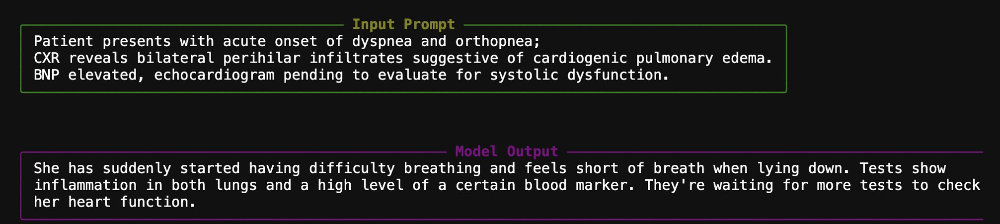
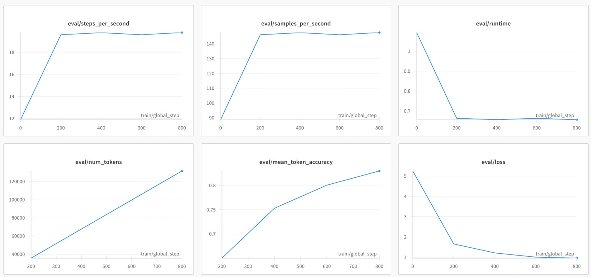

# Fine-Tuning & Deploying Mistral-Nemo-Instruct-2407 to Simplify Medical Text

This project details the workflow for fine-tuning a Mistral 12B language model (Mistral-Nemo-Instruct-2407) to simplify complex medical text. The goal is to make such information more accessible to patients and non-specialists. The process involves data preparation, model fine-tuning using LoRA, adapter merging, and finally, inference and evaluation.

## Project Workflow Summary

The end-to-end process can be summarized in the following key steps:

1.  **Data Acquisition & Preparation:** Utilized the [Medical texts simplification](https://huggingface.co/datasets/liliya-makhmutova/medical_texts_simplification) dataset from Hugging Face. This dataset, containing approximately 800 sentence pairs (complex medical text vs. simplified versions), was prepared for supervised fine-tuning.
2.  **Baseline Evaluation (Context):** While not a dedicated notebook in this series, understanding the performance of the pre-trained Mistral-Nemo-Instruct-2407 model on the simplification task *before* fine-tuning provides a crucial baseline for assessing the impact of the subsequent steps.
3.  **Supervised Fine-Tuning (SFT):** Employed Low-Rank Adaptation (LoRA) for parameter-efficient fine-tuning of the base model using the prepared dataset.
4.  **Model Merging:** Merged the trained LoRA adapters with the original base model weights to create a standalone, fine-tuned model.
5.  **Inference & Interactive Testing:** Utilized the fine-tuned model for generating simplified text from new complex medical notes via an interactive interface.
6.  **Evaluation:** Assessed the performance and quality of the fine-tuned model's simplifications.

Below is a breakdown of the Jupyter notebooks that implement these stages.

---

## Notebook Stages

The implementation is divided into four notebooks, each handling a distinct stage of the model development lifecycle:

### Stage 1: Fine-Tuning (`stage1_finetuning_mistral-12b.ipynb`)

This notebook covers the core supervised fine-tuning process.

* **Key Activities:**
    * Environment setup and library imports.
    * Loading and preparing the "Medical texts simplification" dataset (see details below).
    * Formatting data with instruction prompts (e.g., `<s>[INST] ... [/INST]`).
    * Loading the base Mistral-Nemo-Instruct-2407 model (BF16 precision).
    * Configuring LoRA (Low-Rank Adaptation):
        * Rank: 64
        * Targeted Layers: Attention and gate projection layers.
    * Setting up training hyperparameters (learning rate, epochs, batch size).
    * Training the model using Hugging Face's `SFTTrainer`.
    * Saving the trained LoRA adapter and uploading it to Hugging Face.

* **Dataset Details:**
    * **Name:** Medical texts simplification
    * **Source:** [Hugging Face Datasets](https://huggingface.co/datasets/liliya-makhmutova/medical_texts_simplification)
    * **Origin:** Derived from a subset of the "Medical Notes Classification dataset".
    * **Content:** Comprises approximately 800 sentences structured in triples: original complex medical text, a human-authored simplification, and a ChatGPT-generated simplification. These originate from clinical domains including Gastroenterology, Neurology, Orthopedics, Radiology, and Urology. For fine-tuning, pairs of original text and their corresponding simplified versions (e.g., human-simplified) are used.
    * **Rationale:** Created to address the difficulty patients face in understanding complex medical language, aiming to improve patient engagement and health outcomes.
    * **Key Columns Used:** `original` (complex text) and `human_simplification` (target for SFT) or `chatgpt_simplification`. *(Specify which simplified version was primarily used for your training if possible).*
    * **Important Considerations (from dataset card):**
        * Should not be used for patient treatment without medical professional supervision.
        * Not for commercial use.
        * Models trained on this dataset may produce hallucinations.
        * Refer to the dataset card on Hugging Face for a full analysis of data collection, processing, and potential biases (especially regarding ChatGPT outputs).

* **Visualizations:**
    * LoRA Configuration & Model Architecture Overview:
        
    * Training Progress:
        
    * Inference Chat Template/Data Formatting:
        

### Stage 2: Model Merging (`stage2_merge_model.ipynb`)

This notebook focuses on integrating the fine-tuned adapter weights with the base model to create a complete, deployable model.

* **Key Activities:**
    * Loading the base Mistral-Nemo-Instruct-2407 model.
    * Loading the fine-tuned LoRA adapter (from Stage 1).
    * Merging the adapter weights into the base model.
    * Saving the fully merged (fine-tuned) model locally.
    * Pushing the merged model to Hugging Face for wider accessibility and deployment.

### Stage 3: Interactive Testing (`stage3_live_chat.ipynb`)

This notebook provides a simple interface for interactively testing the simplification capabilities of the merged, fine-tuned model.

* **Key Activities:**
    * Loading the merged model and its tokenizer.
    * Setting up a text generation pipeline for inference.
    * Implementing a basic command-line chat interface (using the Rich library for better visual formatting).
    * Testing with sample medical prompts and observing the simplified outputs.

* **Example Output:**
    

### Stage 4: Evaluation (`stage4_evaluation.ipynb`)

This notebook is dedicated to comprehensively evaluating the performance and quality of the *fine-tuned model's* simplifications.

* **Key Activities:**
    * Testing the model on a diverse set of medical text samples not seen during training.
    * Employing a GPT-based external evaluator to rate the quality of simplifications (e.g., on a 1-10 scale for clarity, accuracy, and preservation of meaning).
    * Benchmarking generation time per sample.
    * Presenting original and simplified texts side-by-side for qualitative review.

* **Key Findings & Visualizations:**
    * The fine-tuned model consistently achieves high simplification scores (e.g., predominantly 8/10 as per the external evaluator).
    * Demonstrates a strong ability to rephrase complex medical jargon into patient-friendly language while retaining crucial medical information.
    * Evaluation Metrics:
        

---

This structured approach ensures robust model development, from initial fine-tuning to thorough evaluation, ultimately yielding a capable medical text simplification tool.